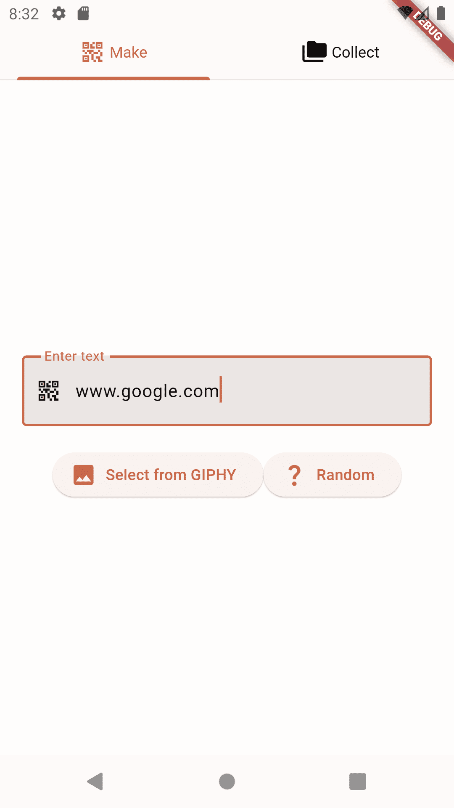
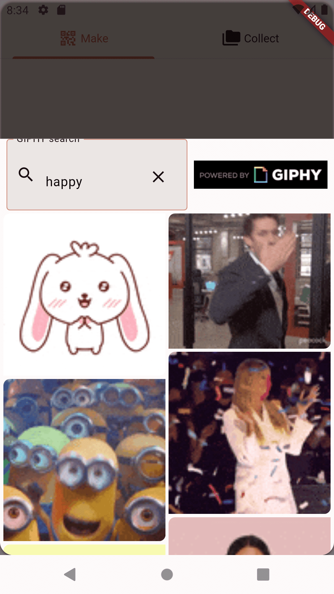
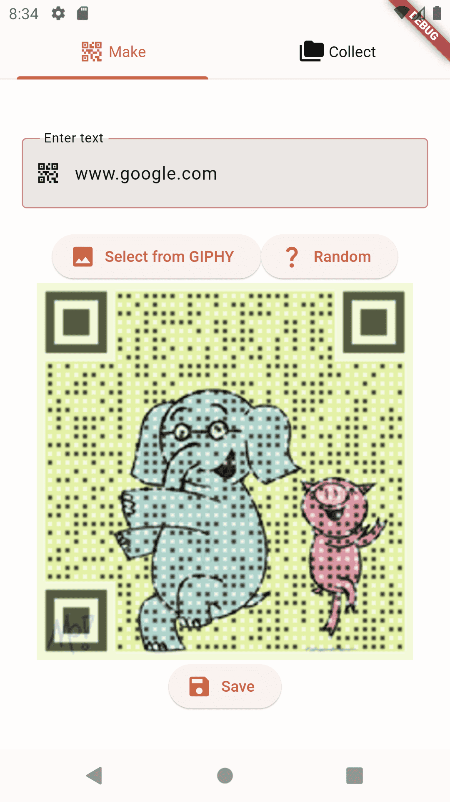
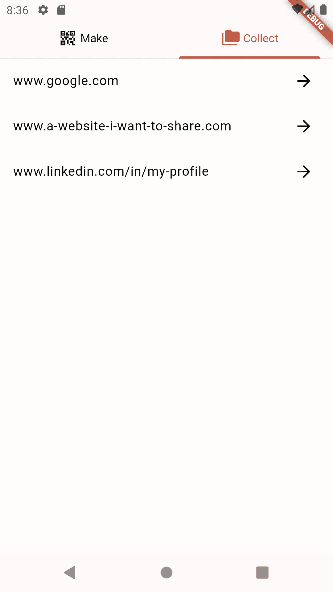
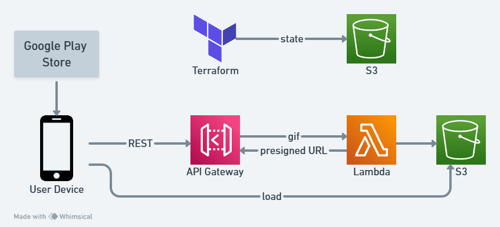

<link rel="stylesheet" href="../css/images.css">

Overlays a QR code onto a GIF, which I use as a fun way to share links. It's available on the [Google Play Store], and here's the [source code].

{: .align-center}

    
    
    
    

---

When your phone scans a QR code, it uses the corner boxes to calibrate position and orientation of the image. It then uses the centre of each image to determine if the block is black or white. The edges of each box can be made transparent without significantly impacting the readability of the QR code.

It uses flutter as the front-end, which talks to the GIPHY API to preview and select GIFs. A request is sent to a Python backend that generates a QR Code, adds transparency, and overlays it on each frame in the GIF. The result is saved into an S3 bucket, which is loaded by the flutter app and cached on the phone.

[Google Play Store]: https://play.google.com/store/apps/details?id=com.gif_code
[source code]: https://github.com/Nick-Sullivan/gif-code
