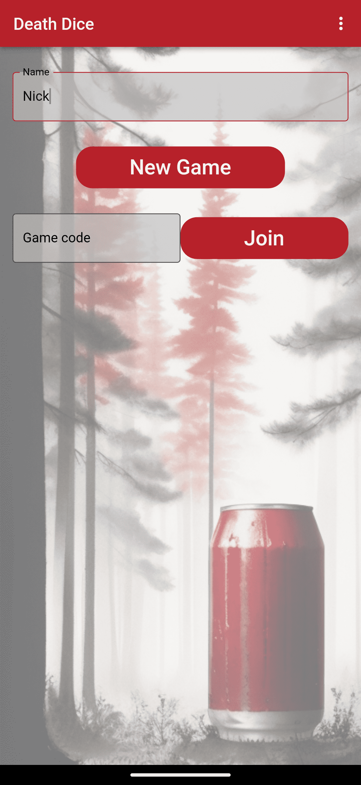
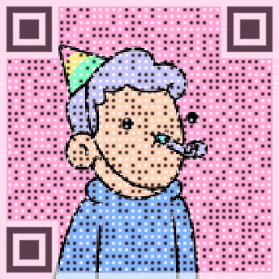

Welcome!

I'm Nick, a software engineer with a Ph.D. in robotics and strong mathematical and data skills. I specialise in back-end software (Python/C#), cloud infrastructure (AWS) and algorithm design. I’m passionate about product-minded engineering, including automation and data analytics. I'm located in Adelaide, Australia.

This website is a collection of experiments and side projects, that is hopefully as interesting to you as they are to me.

---
