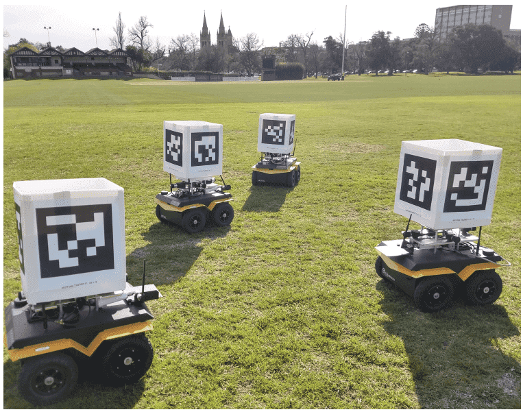

<link rel="stylesheet" href="../css/images.css">

My Ph.D. was completed at the [University of Adelaide] in 2019.

<a href="../assets/pdf/phd.pdf" download="nick-sullivan">You can download it here.</a>

In short, it introduced new methods in the overlap of task allocation and collaborative localisation. Task allocation is the decision making of how to allocate agents to multiple jobs, and collaborative localisation is a sensor fusion technique to allow multiple agents to improve their understanding of their location and orientation.

We developed a highly scalable path planning algorithm that ensures agents stay near one another:

    
    
    

We assessed the impact of sensor noise on collaborative localisation:

    
    

We introduced improvements to auction-based allocation when the agents have different capabilities:

    

---

[University of Adelaide]: https://digital.library.adelaide.edu.au/dspace/handle/2440/120578
