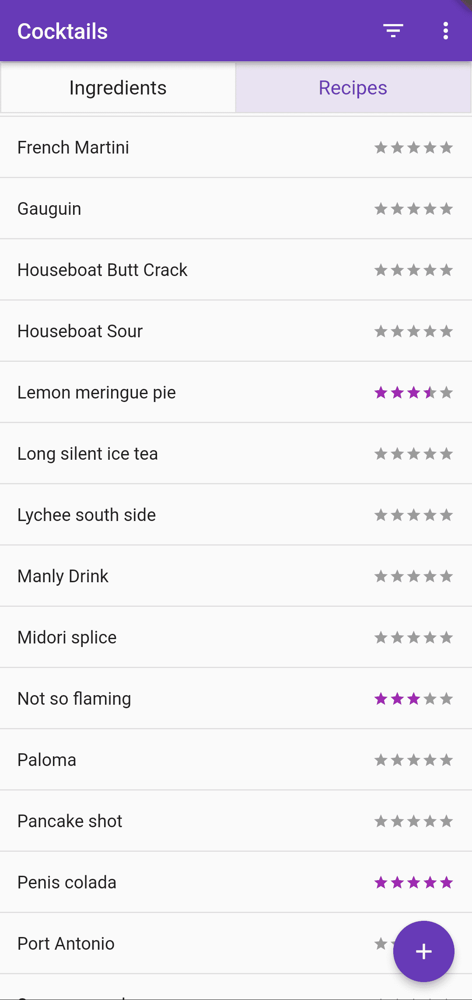

<link rel="stylesheet" href="../css/images.css">

A simple Android app to store cocktail recipes.

My friends and I will occasionally have a cocktail night, where we invent new recipes. The apps on the play store were either too generic (like a note-taking app) or too complex (requiring manual linking between ingredients and recipes).

In this app, the recipes are entered as text, and auto-links to ingredients so that they can be filtered by what ingredients you in stock. Here's the [source code].

    <!-- 
 -->
    
    
    
    
    

        &times;
        
        <button id="prev-btn" onclick="changeImage(-1)">&lt;</button>
        <button id="next-btn" onclick="changeImage(1)">&gt;</button>
    

[source code]: https://github.com/Nick-Sullivan/cocktail-bar
