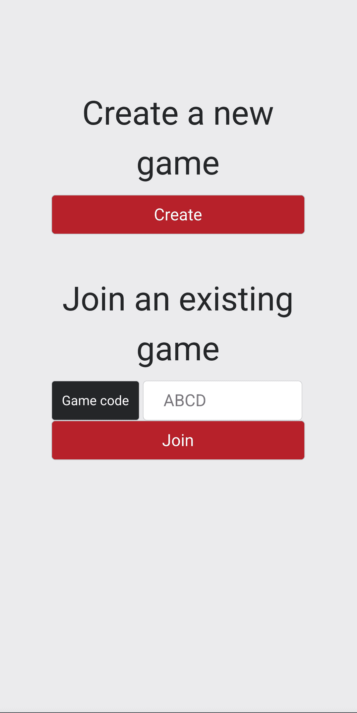
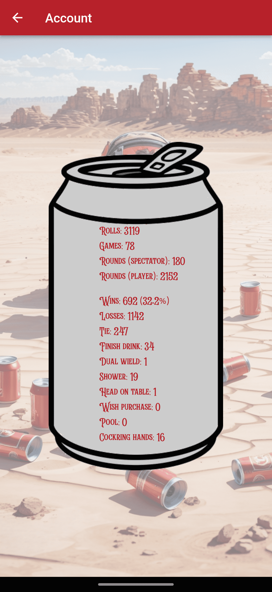

An online version of a drinking game my friends and I play, so that we could continue playing incase we got locked down during COVID.

The rules are intentionally obscure, won't make any sense to new players, and is 100% luck.

You can find the game here, [good luck!]. And here's the [source code].

I presented this project in an Adelaide AWS user group in September 2022. [Here's a copy of the presentation].

---

The public website is stored in an S3 bucket and distributed by CloudFront. The browser establishes a websocket connection to send actions and receive game status updates. The game logic is performed by lambdas, and the game state is stored in DynamoDB. Whenever the game state is changed, an event is sent to a game history SQS. Each day, an scheduled event triggers a lambda to read large batches of messages from the SQS, compresses them, and stores them as parquet files inside an S3 bucket. This triggers another event, which invokes a lambda that creates a new partition for that day, and invokes an SQL query in Athena which aggregates the statistics for that day, for each player. The result is then stored inside another DynamoDB table. Those daily and summarised statistics are available from another API gateway endpoint.

[source code]: https://github.com/Nick-Sullivan/death-dice
[Here's a copy of the presentation]: ../assets/pdf/drinking_game.pdf
[good luck!]: https://100percentofthetimehotspaghetti.com/dice.html
