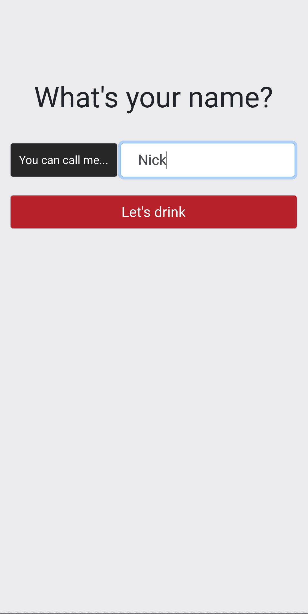

An online version of a drinking game my friends and I play, so that we could continue playing were we to be locked down during COVID.

The rules are intentionally obscure, and is 100% luck.

You can find the game here, [good luck!]

Here's the [source code].

I presented this project in an Adelaide AWS user group in September 2022. [Here's a copy of the presentation].

[source code]: https://github.com/Nick-Sullivan/death-dice
[Here's a copy of the presentation]: ../assets/pdf/drinking_game.pdf
[good luck!]: https://100percentofthetimehotspaghetti.com/dice.html
